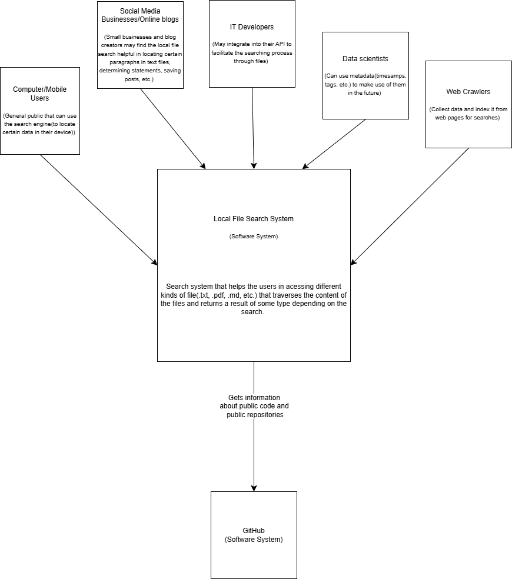
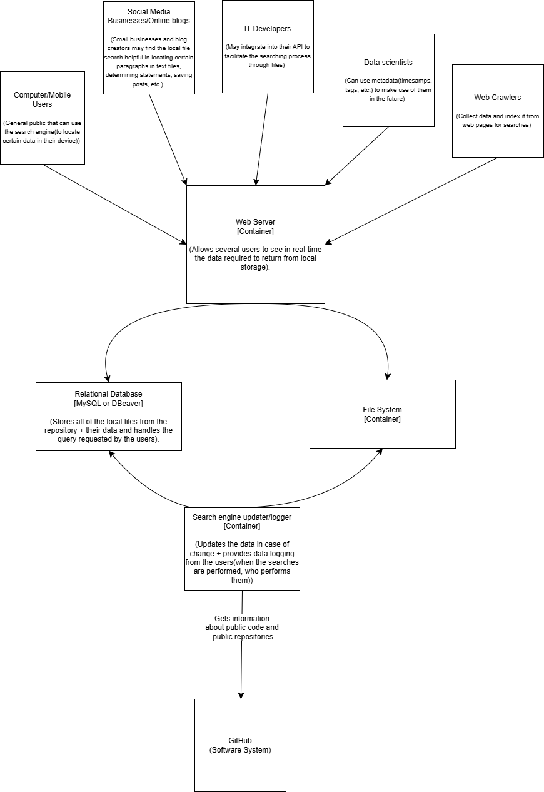
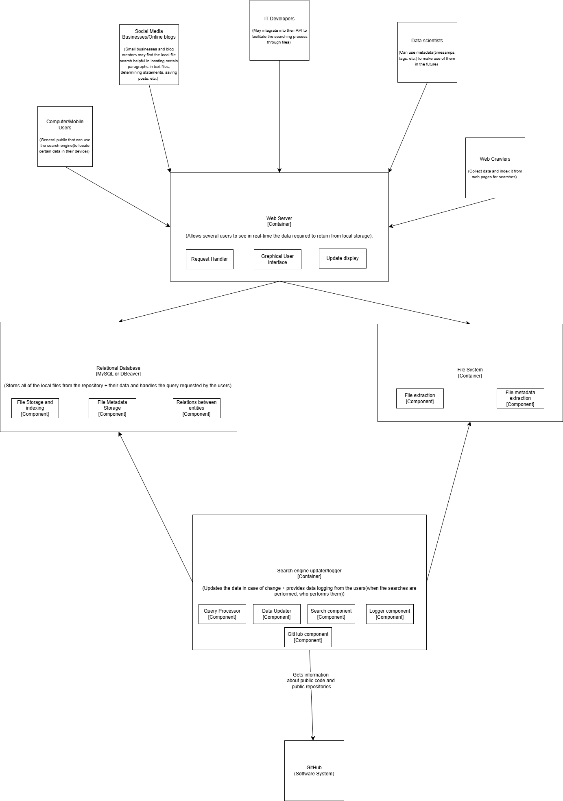

# Search Engine Architecture

## Overview
This document provides an overview of the architecture of the search engine system, detailing its components and dependencies.

---

## 1. System Context
The search engine system allows users to search and retrieve relevant information from indexed media files(.txt, .pdf, etc.). It interacts with a lot of users, such as:

- **General Users**: Submit search queries and receive ranked results.
- **Businesses & Organizations**: Mostly online-based.Small businesses and blog creators may find the local file search helpful in locating certain paragraphs in text files, determining statements, saving posts, etc..
- **Web Crawlers**: Collect data and index it from web pages for searches.
- **IT Developers**: May integrate into their API to facilitate the searching process through files.
- **Data Scientists**: Integrate search API into applications.
- **Local File Search System**: Search system that helps the users in acessing different kinds of file(.txt, .pdf, .md, etc.) that traverses the content of the files and returns a result of some type depending on the search.
- **GitHub**: Software System.

---

## 2. Containers
The containers diagram consists of multiple units that execute the code written, each serving a distinct role.

### 2.1 Web Application (Frontend)
- Allows several users to see in real-time the data required to return from local storage.

### 2.2 Relational Database
- Stores all of the local files from the repository + their data and handles the query requested by the users
- Technologies: **MySQL or PostgreSQL**

### 2.3 Search Query Updater/Logger
- Updates the data in case of change
- Provides data logging from the users(when the searches are performed, who performs them)

### 2.4 File System Container
- Stores raw data files, logs, and search index backups.
- Technologies: **Local File System.**

---

## 3. Components
Each container has multiple components. The components diagram show what are those components of the containers, how are they working and their responsabilities.

### 3.1 Web Application
- **Request Handler**: Handles the requests send by the user.
- **Graphical User Interface**: Used for communicating with the application.
- **Update display**: Updates the GUI and what it is shown as the user completes the query.

### 3.2 Relational Database
- **File storage and indexing**: Handles the storage of the data and indexes in the tables of the database.
- **File Metadata Storage**: Handles the storage of the timestamps, tags, etc.
- **Relations between entities**: The interactions between the entities of the data.

### 3.3 File System Components
- **File Extraction**: Extracts the files from the system.
- **Metadata Extraction**: Handles the extraction of the metadata.

### 3.3 Search Engine Updater/Logger
- **Data Processor**: Cleans and normalizes data.
- **Index Builder**: Creates and updates search indexes.

### 3.4 Query Engine
- **Query Processor**: Analyzes the operations of the queries.
- **Data Updater**: Updates and normalizes data..
- **Search Component**: Performs the operations on the files needed.
- **Logger Component**: Provides logging for other components.
- **GitHub Component**: Provides facilities in communicating with GitHub.

